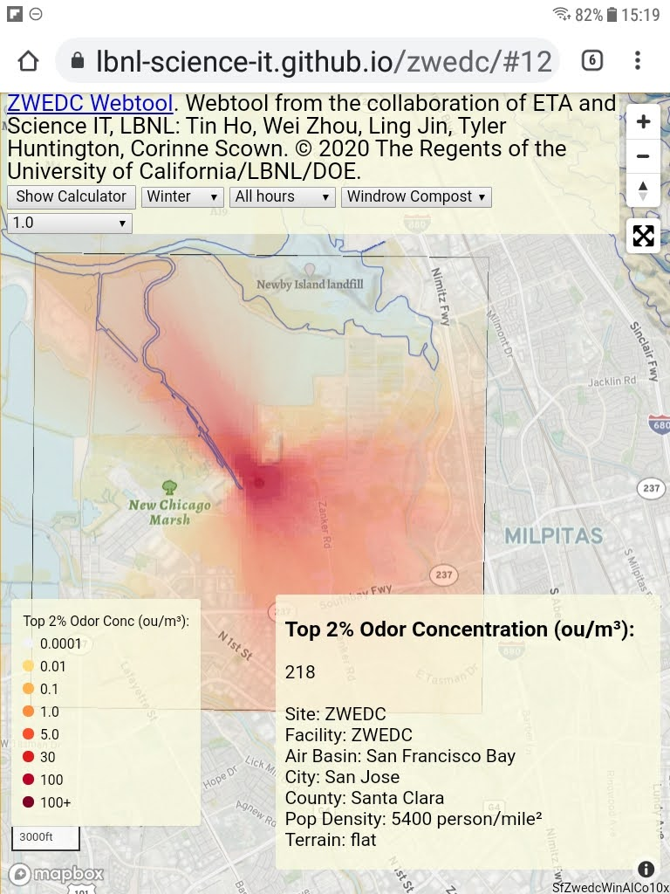

ZWEDC WebTool
=============

This webtool displays potential odor impact from the 
Zero Waste Energy Development Company at Alviso, San Jose, CA, 
an anaerobic digestion waste to biomethane (or electricity) generation site.

ZWEDC Webtool provides an interactive visualization of atmospheric dispersion of odorous compounds emitted from ZWEDC waste-to-energy site in Alviso, San Jose, CA.

* Odor is very subjective. Unpleasant odors in the 5 to 10 ou/m^3 range usually trigger complaints.
* Odor emission rates from various processing stages are estimated from ZWEDC, a dry Anaerobic Digestion facility with a full capacity of 90,000 ton/year of organic waste.
* Map represents the top 2 percentile in the distribution of the simulated odor concentrations over a three year period.
* **No** outdoor composting is currently present onsite. A hypothetical onsite outdoor composting emission is estimated based on bagged outdoor composting as practiced at ZBest.

For further infor, please see
`About <http://zwedc.lbl.gov/About.html>`_ 

Webtool accessible at
  * https://zwedc-webtool.github.io/ - public access site with DRAFT data
  * https://lbnl-science-it.github.io/zwedc/ - temporary dev/staging site

This web-based application is a 
collaboration of 
`Energy Technology Area <http://eta.lbl.gov>`_ 
and 
`Scientific Computing <http://lrc.lbl.gov>`_
at 
`Lawrence Berkeley National Lab <http://www.lbl.gov>`_.
By: 
Tin Ho, Wei Zhou, Ling Jin, Tyler Huntington, Corinne Scown.

Contact us: tin (at) lbl.gov   or ljin (at) lbl.gov

© 2020 The Regents of the University of California, through Lawrence Berkeley National Laboratory (“Berkeley Lab”) subject to receipt of any required approvals from the U.S. Dept. of Energy.  All rights reserved.  See `LICENSE <LICENSE>`_ for details.

`Mapbox <https://mapbox.com>`_ and its affiliates assert copyright on their maps and API.  

